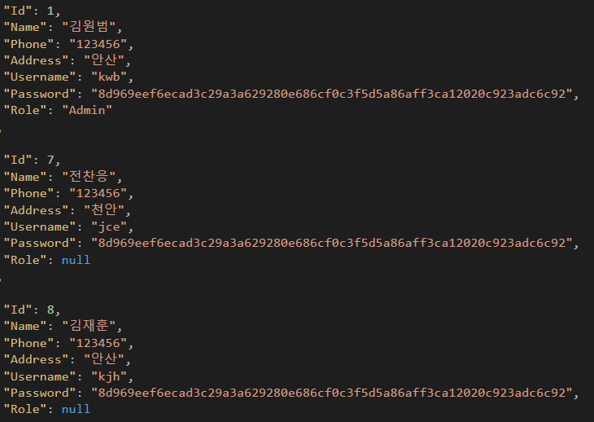
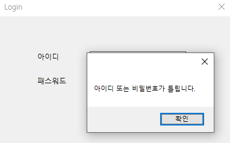
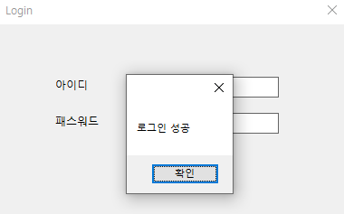
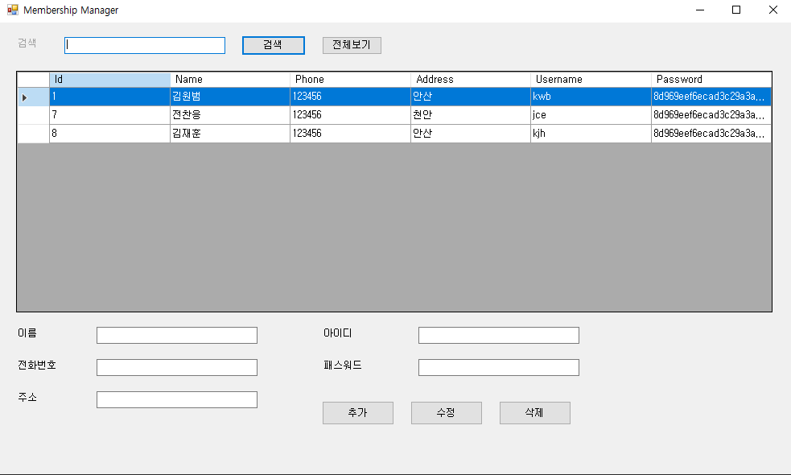

# Membership Manager (C# WinForms)

C# WinForms 기반으로 구현한 **회원 관리 프로그램**입니다.  
회원 정보를 JSON 파일로 저장하고 로그인 및 관리자 권한 기반 접근 제어 기능을 구현했습니다.

---
## Architecture

MembershipManager
 ┣ Data
 ┣ Forms
 ┣ Models
 ┣ Services
 ┣ Utils
 ┗ Program.cs

 ---
 
## 주요 기능

- 회원 등록 / 수정 / 삭제 (CRUD)
- 회원 목록 조회 (DataGridView)
- 회원 검색 기능
- JSON 기반 데이터 저장
- 로그인 기능
- 관리자 / 일반 사용자 권한 구분
- SHA256 비밀번호 해싱

---

## 데이터 저장 방식

회원 데이터는 **List → JSON 파일**로 변환하여 저장합니다.

관리자 계정은 `Role = "Admin"`으로 구분됩니다.

```json
{
  "Id": 1,
  "Name": "김원범",
  "Phone": "123456",
  "Address": "안산",
  "Username": "kwb",
  "Password": "SHA256_HASH",
  "Role": "Admin"
}
```

---


## 실행 화면

### JSON 데이터 저장 구조


### 로그인 실패


### 로그인 성공


### 회원 관리 화면


---

## 기술 스택
- C#
- .NET Framework
- WinForms
- JSON 데이터 처리
- SHA256 Hash

